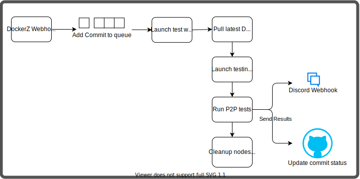

# DockerZ End-To-End Testing

## Why
We created our own `end-to-end` testing framework because we needed an easy way to test our `peer-to-peer` logic. Traditional frameworks could not fit our requirements as we needed to test the interactions between a whole network of nodes. 

## Timeline
- ### Webhook
    If the `webhook` receives a new request (a new commit), it adds to the internal `queue`.

- ### Queue
    The `queue` saves all new commits as tasks that must be tested.

- ### Task
    If a `task` is popped off the `queue` to process, a new `worker-thread` is created to start the testing.

- ### Testing
    To set up the testing, DockerZ pulls the new `docker image`, which holds the binary of a node. 
    These nodes are then launched to create a `network` in which `peer-to-peer` and `end-to-end` tests can be run. 
    Before the tests can be started, the program waits until the nodes are properly started. After this, a number of tests such as sending a block, claiming a block and pinging are executed. The results of these tests are then pushed to Discord and GitHub.

- ### Discord
    A Discord server channel is updated with a message stating the result of the tests.

- ### Cleanup
    At the end of the tests, the containers are cleaned up.