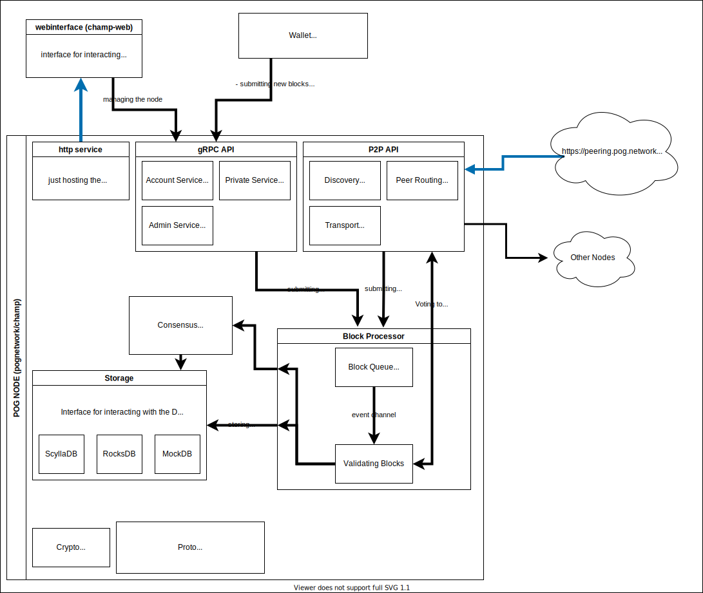

# Overview

We've created a diagram to help understand the general structure of this project:



## gRPC API

Our gRPC API is one of the main ways for external applications to interact with our software. gRPC is a transport protocol based on HTTP which enables us to do typesafe procedure calls through a nice api. In addition, we've enables `grpc-web` support which enables web applications to interact with this api, similarly to how you would call a normal web api.

For more detailed information on this, you can check out our repo containing all of our protocol buffers at [pognetwork/proto](https://github.com/pognetwork/proto). Here you can also find our npm and rust packages for interacting with the api.

Also, we've created a [list of rpc methods](./rpc-api.md) with some more documentation on the purpose of all of our methods (For interacting with, please use our language client packages or protobuf files directly).

### Authentification

Authentification is dome with JSON-Web-Tokens. New users can only created through the champ cli using `champ user create`.

This is the case since all of our authenticated APIs are essentially for `intranet` type usage and should not be exposed to the public internet. More on that in our _securing your champ node_ section.

After a new account has been created, `NodeUser.Login` can be called with your username and password to obtain a jwt.
From this endpoint you will recieve your token which you can include in the the `authorization` metadata field to authenticate your request. For endpoints requiring authentication, the node will then validate your token and check if you have the neccecary permisions. Currently, the following permissions are available and can be configured in your `champ.toml` config file.

```ini
"admin.read"         -> Read-access to the NodeAdmin Service
"admin.write"        -> Write-access to the NodeAdmin Service
"wallet.create"      -> Create a wallet on a node
"wallet.{id}.sign"   -> Write.access to a wallet with {id}
"wallet.{id}.manage" -> Edit.access to a wallet with {id}
"wallet.{id}.unlock" -> Write.access to a wallet with {id}
"superadmin"         -> Access to all
```
