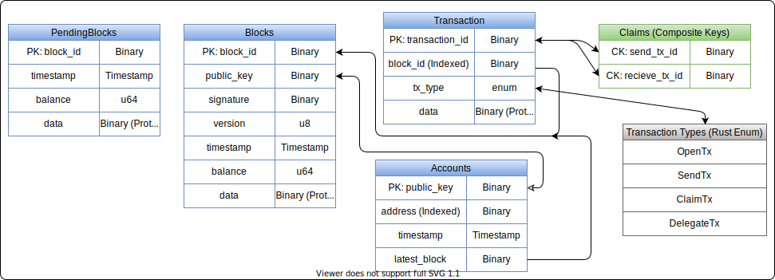

# SQL Storage Backend Support

> Not (yet) recommended for production use

Champ allows node operators to choose a variety of storage backends, one category of which is based on rational databases. Supported are SQLite, Postgres and MySQL. This is provided as a option to improve speed and fault tolerancy, so sqlite is not recommended and our sled-based storage backend should be used for these simpler, self-contained deployments.

## Entiry Relationship Diagram

## A cryptocurrency running on a SQL Database????

While it might - from a first glance - seem like this enables node operators to easily forge and edit transactions, this is the case for any cryptocurrency. The whole point of cryptocurrencies is to have verifiability independent of a single actor, and while individual node operators can operate on in bad faith, the greater network can detect this and reprimand individual nodes and verify any transaction independently. While you can change different fields, you can't (at least without a currently impossible quantum computer) forge signatures verifying each action.

Most cryptocurrencies are build on simple key-value stores like `rocksdb` or `lmdb`. While our primary/default storage backend is also based on `sled`, which is in the same category as these, we decided to build out a SQL-based alternative. This is mainly to enable some interesting use-cases for analysis purposes on the live network and also to see if our assumtion, that a simple storage backend doesn't necceceraly improve speed and reliability compared to a battle-testet and hyper optimised database like postgresql, holds true.
