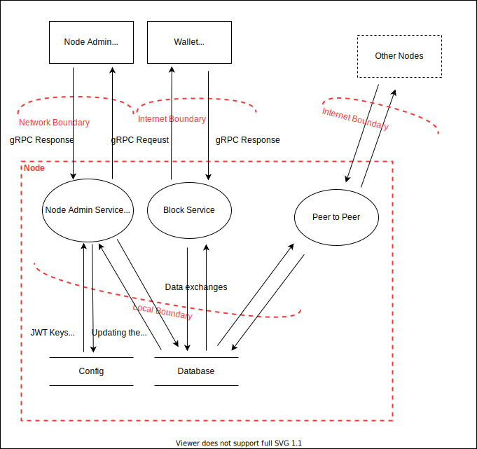

# Security at Pog.Network

## Threat Model

### **Description**

- ### gRPC

    - gRPC Requests are the requests made by the client to the node. Requests can range from fetching the wallet balance to updating the node.
    - gRPC Responses are the responses made by the node that provides the requested necessary information to the client.

- ### Database

    Database queries, in the diagram marked as `data exchanges`, handle saving and retrieving the data for the services and the node. 

## Threats

- ### All outgoing connections

    **Description**
    These include the P2P Networking and gRPC connections between the node and the Web Clients.

    > DDOS: We plan to add rate limiting and, we will guide Node Operators for optimal setup as we won't run the nodes ourselves.
     (_Denial of Service, High Severity_)

    > Insecure SSL version: In a release, we plan to refuse connections with a TLS version different than 1.3 and refuse insecure connections. Currently, everything is accepted for development purposes.
      (_Tamperling, High Severity_)

- ### All Web Clients

    **Description**
    These include the Wallet and the Admin interfaces.

    > XSS Attacks: `Mitigated` because React sanitizes all user input and therefore prevents accidental script injections. Furthermore, we plan to implement a Content Security Policy.
      (_Elevation of Privilege, High Severity_)

- ### Node Admin and Node Wallet Manager Web Clients only

    > CSRF Attacks: `Mitigated` because we avoid using Cookies that could carry sensitive information. Our short-lived JWTs are stored in the browser session storage.
      (_Spoofing, High Severity_)

- ### Node Admin Service and Node Wallet Manager Service

    **Description:**
    These Services are the endpoints for the Web Clients of similar name.
    The severtiy of these attacks are lower, as these enpoints are not open to the internet by default but are contained within the local network.

    > Credential Stuffing: `Mitigated` because we hash passwords in storage and we use the [Have I Been Pwned](https://haveibeenpwned.com/) Range API to securely (with k-Anonymity) check if a password has been part of a breach. 
      (_Elevation of Privilege, Medium Severity_)

    > Credential Cracking: `Mitigated` because we hash passwords that take longer to compare and we plan to implement a rate limiting mechanism.
      (_Elevation of Privilege, High Severity_)

- ### Block Service

    **Description:**
    This is the endpoint to the Wallet Web Client that handels user requests to view their wallet or chain information.

    > High Complexity Queries: We plan to add size limits to requests to preventing users from executing high workload requests.
      (_Denial of Service, Medium Severity_)

- ### Database

    > Injection: `Mitigated` because we use the [Sled](https://github.com/spacejam/sled) database that works more as a key-value storage and is therefore not susceptible to injection.
     (_Elevation of Privilege, High Severity_)

- ### Peer to Peer

    > DDOS: We plan to add rate limiting and we will guide Node Operators for optimal setup as we won't run the nodes ourselves.
     (_Denial of Service, High Severity_)

    > Sybil: `Mitigated` because our consensus algorithm prioritizes accounts that lose money over a period of time which makes farmed account importance inconsistant. We also plan to polish this algorithm and create another that attempts to recognize farming accounts.
     (_Sybil, High Severity_)
## Contributions

- Alexander Gemmingen ([@Alyks1](https://github.com/Alyks1))
    * Have I been pwned API check [[1]](https://github.com/pognetwork/champ/pull/87)
    * Crypto module (such as block signing and JWT) (Pair-Programming with Henry Gressmann) [[1]](https://github.com/pognetwork/champ/pull/28) [[2]](https://github.com/pognetwork/champ/pull/66)
    * Designed graphs & calculations for the consensus algorithm [[1]](https://github.com/pognetwork/champ/pull/22) [[2]](https://github.com/pognetwork/champ/pull/83)
